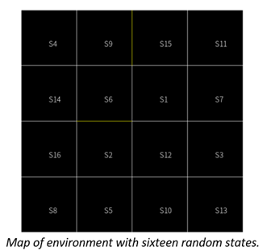

# Mobile Robot Localization

## Objective

The goal of this task is to tackle a simple case of mobile robot localization problem using Hidden Markov Models. We use an example of a mobile robot in a warehouse. The agent (robot) is randomly placed in an environment (warehouse), and its supervisors cannot observe what happens in the room. The only information the supervisors receive are the sensor readings from the robot.

## Intro/Background

In 2003, a team of scientists from Carnegie Mellon University created a mobile robot called Groundhog, which could explore and map an abandoned coal mine. The robot was able to navigate through toxic tunnels that were too dangerous for humans. The robot's task was to simultaneously explore and map the unknown environment.

Fifteen years later, the problem of simultaneous localization and mapping (SLAM) is still being researched by scientists. This technology is used not only in self-driving cars and rovers but also in domestic robots like iRobot's Roomba. Amazon has doubled its robotic fleet in 2017 to move packages through warehouses. Advanced robots are expected to work alongside humans in the future, performing more complicated tasks. Thus, robots' ability to understand their position in the environment is essential in the current state of technology.

- Hidden Markov Model:
The Hidden Markov Model (HMM) is a simple way to model sequential data.  The HMM can be used in situations such as the data consists of a sequence of observations, the observations depend (probabilistically) on the internal state of a dynamical system, and the true state of the system is unknown.

## The environment

The agent can move within an area of 16 square tiles. In the mini warehouse there is one shelf located between tiles S9 and S15 and a second shelf between S6 and S2. The time is also discrete. At each subsequent time step the robot is programmed to change its position with a probability of 90% and moves randomly to a different neighboring tile. As soon as the robot makes a move, we receive four readings from the sensing system.

Yellow line represents shelf, white line is tile and border lines are the walls.

## Sensor

The robot is able to detect obstacles in four directions: North, South, East, and West. Sensor values are conditionally independent given the position of the robot. The device is not perfect, and the sensor has 25% error rate= 25%

### Transition Model

The transition model is the probability of a transition from state i to state j. Knowing that at time t-1 the agent was in state i, it gives us the probability of the agent being in state j in the current time t.

### Initial State

We don’t know where the robot is, so, the probability for each state is:

### Sensor Model

Sensor model consists out of evidence, which allows to make inference about the agent’s position in the environment.

Where e is the error, d = discrepancy – a number of signals that are different between the true values for tile i and the actual reading.

Assume the sensor reading is “SWE”, at time step 1 at state 2 with error observation e = 0.25.

## Results and Discussion

In the state at time t1 (step 1), the robot has a high probability of being in the state S3 with a probability of 52.5%. In the state at time t2 (step 2), the robot has a very high probability of being in the state S3, with a probability almost equal to 73.5%. In the state at time t3 (step 3), the robot has a very high probability of being in state S8 with a probability of 61.89%. In the state at time t4 (step 4), the robot has a very high probability of being in state S8 with a probability of 94.3%. In the state at time t5 (step 5), the robot has a very high probability of being in state S5 with a probability of 82.7%

## Conclusion

By using Hidden Markov Model, we have shown how to model a robot, which can move within an area of 16 squares. This robot is equipped with sensors, which detect obstacles in four directions: North, South, East and West. They have an error rate of e = 25%. The objective of this work is the prediction of the robot localization by taking into account the robot, the sensors, and the environment obstacles.

