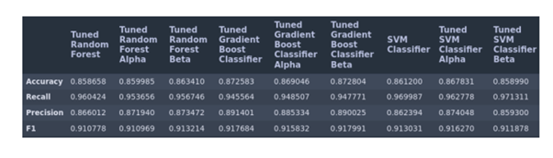

# Employee Salary Classification

## Objective

In this task, we are to classify whether a person’s salary is above or below $50,000 based on a given data set. To accomplish this, we are allowed to use and apply different machine learning algorithms such as Decision Tree, Random Forest, Bagging Classifier, Gradient boosting classifier and Support Vector Machines, along with any relevant deeper studies performed outside of class.

## Dataset

The dataset used in the project contained 15 features, including age, work class, education, occupation, and salary, among others. The non-numeric features covered a range of representative data, including nine categories of employment sectors for the 'workclass' feature. The 'fnlwgt' feature was found to have a weak correlation and was dropped from the dataset. Cleaning involved removing various "?" entries for rows in 'native-country', 'workclass', and 'occupation'. Outliers were not removed as they were highly relevant to the data. The data was not scaled or normalized due to the features being close in scale to each other. Overall, the data manipulation and preprocessing phase involved removing irrelevant features and cleaning the dataset to prepare it for analysis.

## Methodology

The EDA (Exploratory Data Analysis) began with univariate analysis, which involved plotting boxplots and histograms for each of the numeric features in the data set. It was found that 'capital-gain' and 'capital-loss' were right-skewed, and the mean and median for 'age', 'education-number', and 'hours-per-week' were similar. A bivariate analysis was then conducted for the non-numeric features, and it was found that 'Private' was the majority of entries for 'workclass', 'HS-grad' was dominant in 'education', and "married-civ-spouse' was the main feature for 'marital-status'. "Salary" was found to be 24.89% above $50,000. Pairplot() method from the Seaborn package was plotted, which showed no notable information. A sampling of graphs were presented to represent the treatment of all features, and this concluded the EDA process.

 

 

We moved into the model building phase, where we individually tested the performance of multiple types of classifiers, including decision trees, random forests, bagging classifier, gradient boosting classifier, and SVM. Developed two functions to handle each of the models and generate a confusion matrix for each. The data frame was modified in preparation for training by converting the ‘salary’ feature to a binary representation, and split into ‘X’ and ‘Y’ (training data and targets respectively) using the train test split method. The models were assigned and fit, and the metrics used to assess the model's performance were accuracy, recall, precision, and F1 score. GridSearchCV was used to tune the hyperparameters of each model.

After tuning each model, their metrics were reassessed and compared via a grid. The top 15 features of the two best performing models were selected using feature_importances_ method and a second round of training was conducted on these features labeled as alpha and beta. This marked the end of the experimentation with the given data set.

## Results

The best performing model we were able to generate for the original data set was the random forest classifier after tuning with an accuracy of ~86% and a recall of ~96%. Close to this we achieved similar results in multiple other models as shown A.

The best performance seen for the alpha data set was determined to be the tuned SVM classifier with accuracy of ~85% and recall of ~97% which indicates that trimming the original data set of the less important features was in fact beneficial albeit slightly. The performances of all models for the alpha set are shown in figure B.

For the beta set the result was the same as the alpha set with the tuned SVM classifier performing the best. The results of this set showed an increase across the board yielding the best results of the project with accuracy ~86%, recall ~97%, precision ~86%, and F1 of ~0.912. The comparison of the model’s performance on the beta set are shown in (C). It was also noteworthy that the most important feature for having a salary greater than 50K was determined to be ‘marital status’ (C).

## Conclusion and key take aways

The project achieved relatively successful results with the data provided. 
- The SVM classifier performed the best after feature analysis and tuning, followed by the random forest and gradient boosting classifiers. 
- The data was biased towards representing white males in the US, and collecting more diverse data or rephrasing the prediction to specify for the group most represented by the data would help address this bias.
- Other areas for improvement include exploring new methods of feature engineering to find new correlations in the data and using more powerful machines to reduce training time. Overall, the project was successful in yielding multiple models that performed well.