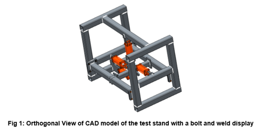
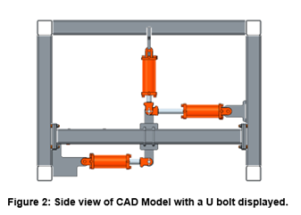
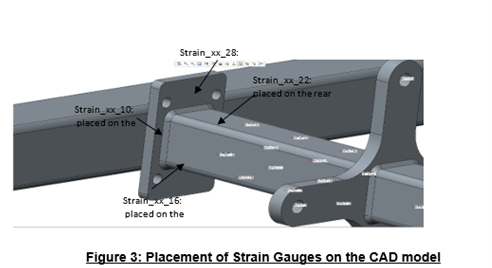
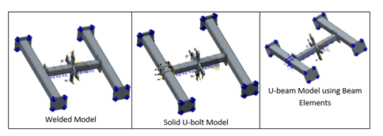
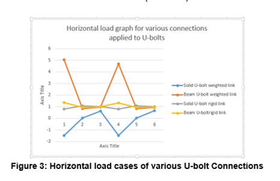
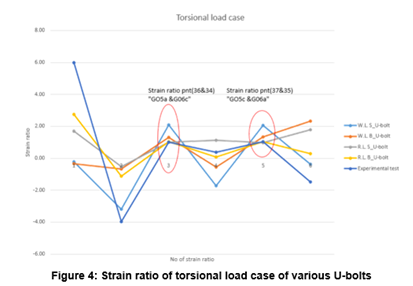
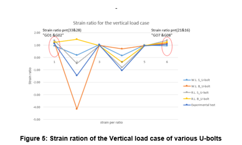

# U-bolts Project

## Problem Statement

The goal of this study is to develop a simple but accurate way of modeling U-bolts for use in Finite Element Analysis. We are to account for the load transfer, stiffness and stresses in U-bolts as used in Kuhn Krause machinery. We are to demonstrate good correlation between U-bolt finite element model and corresponding experimental tests, and lastly, to provide design recommendations for future U-bolt applications.

## CAD

## Strain Gauge placement

## Finite Element Technique

The method to carry out this work is via the use of strain gauges. The Strain gauges are placed on specific locations on the center frame of the 4 by 4” squared tube. A total of 8 gauges are placed on specific spots on the center frame, with four (4) individual gauges on each side. Which will account for strain ratio.

i. Welded Model

For the welded modelling technique, the center frame is welded on both sides on the ends to the plate. While the plate is welded onto the side of the frame. Strain gauges are being placed on the center frame on all the four surfaces, equidistant from the center of the plate which the force is being applied on.  An expected one-to-one strain ratio should be our predicted result considering both sides of the center frame is welded to the side frames and side plates. With an equidistant strain gauge placement, modelling structure placement of welds, stiffness on both sides of the center frame should equal to produce our desired strain result.

ii. Solid U-bolt Model

The solid modelling of U-bolts shows the actual representation of the U-bolt using solid geometries. There is a surface-to-surface contact between the plate and U-bolts using connections like rigid links, weighted links, and springs being placed on certain locations to account for U-bolts stiffness. Stiffness on the solid U-bolt geometry is accounted for through strain gauge points placed on various locations on the center frame. With strain gauge placed on different positions and locations, strain ratio of the welded connection to the solid U-bolt connection will be our primary way to account for stiffness which is being compared to the results obtained from weld-to-weld connection.  In this U-bolt model, we account for the vertical, horizontal and torque force.

iii. U-bolt using Beam Elements

Compared to U-bolt solid models, coupled U-bolt models are a lot simpler to model.
They are modelled using beam elements by creating beam sections of a circle with a diameter of 0.75 in. The beam elements are being connected from point-to-point, after the points have been created and placed on specific locations. The nodes corresponding to the head and nuts are not connected by means DOF or beam releases. The beam elements are being connected to a frame by weighted link (zero stiffness) which is uniaxial with tension, bending and torsional capabilities. With the nut and flange being connected with each other by beam elements, various loads can be transferred, and stiffness can be accounted for through strain gauge measurements.
There is a surface-to-surface contact between the plate and the frame through springs, weighted link and point to point connections. Considering strain ratio of weld-to-weld connection is 1:1, Stiffness is obtained  by using beam-to-weld ratio in comparison to weld-to-weld ratio.

## Results

- From graph shown above, From the graph, Rigid Link Solid U-bolt tends out to be the closest to the experimental test.

- From the plots above, Rigid Link Solid U-bolt tends out to be the closest to the experimental test.

## Testing

The physical test was performed with strain gauges applied at specific spots similar to the CAD model with strain gauges applied. The figure shown below is a demonstration of the experimental set up with strain gauges, steel plates, hydraulic cylinders and bolts applied. Different load cases would be applied, Bending, Axial load cases, and Torsional load cases.

## Conclusion

The goal of this study was to develop a simple and preferred way of evaluating U-bolts for the use of FEA. From the study, the following could be inferred:
- The rigid link Solid U-bolt tends out to be the most preferred method of modeling U-bolts when it comes to applying torsional loads.
- The Weighted link beam U-bolt model tends out to be the closest to the experimental test considering the vertical load case.
- For the Horizontal load case, the rigid link solid U-bolt model tends out to be closer when compared to other modeling technique.

In all, I will recommend the rigid link solid U-bolt technique to be the most preferred way of modeling U-bolts in FEA, as it shows a more closer strain ratio to the experimental test when compared to other U-bolt modeling techniques. 

For future work, I will recommend CAE team to try various ways in applying contacts for other modeling techniques in modeling U-bolt techniques. For example: adding springs, or weighted links as connections between U-bolts and the plate.
