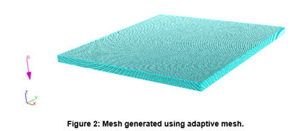

# Laser Cutting of Stainless Steel

## Problem Statement

The aim of this study is to develop a computational fluid dynamics laser cutting process using a CW Nd: YAG laser which would save cost, time for manufacture and easy optimization for manufacturing purpose. Understand the physics behind the laser cutting process and based on input parameters and expected response (kerf width, surface roughness, heat affected zones), compare numerical study to that of experimental data, suggest possible improvements and future research works.

## CAD

- CAD was built using FLOW-3D with a 5 cm x 5 cm sheet block of steel and 0.12 cm metal thickness.

## Meshing

An adaptive set of mesh is generated by FLOW-3D. Mesh size of 0.02 cm (Course mesh). Total cell size 100,000

## Physics

The solver used in this study is a transient, buoyant, and conjugate heat transfer between solid and fluid regions. Material properties for the stainless steel was selected. Heat generation in the laser physics was modelled as uniformly distributed. A constant value in Watts was applied individually as an absolute heat source (Q) from the laser power. A no-slip wall condition was imposed at the inner enclosure walls, where the enclosed air comes in contact with a solid surface. The external free surfaces of the enclosure were given surface film boundary conditions to simulate free convection on the vertical and horizontal surfaces. The sink temperatures for the film boundary conditions were set to an ambient temperature of 25 ⁰C. Sufficiently small Courant number value was used to ensure accuracy of the results and was based on the characteristic time of the modeled system.

## Parameters and response

| Process Parameter | Symbol | Unit  | Value               |
| :---------------  |:-----: | :---: | :-----------------: |
| Laser Power       | *Pl*   | W     | 900, 1000, 1200     |
| Focus Radius      |        |       |                     |
| Cutting Speed     | *v*    | m/min | 2, 4, 6, 7, 8       |
| Gas Pressure      | *Br*   | bar   | 4, 8, 9, 10, 11     |
| Beam Profile      |        |       | Gaussian            |
| Focus Position    | *Pf*   | mm    | -1, -0.5, 0, 0.5, 1 |

## Results

From the results shown, within a time from of .039 seconds there is relatively low temperature distribution observed when a speed of 8m/min is run, which makes the process safe.

The plot shown above depicts laser speed at different velocities with respect to laser power and kerf width distance. From this it is inferred that, an increase in laser power leads to an increase in kerf width distance.

## Conclusion and future works

From study, the cutting parameters that provided little dross and sharp cutting surface using CW Nd: YAG laser were laser power of 600 – 1900 W, cutting speed 6-8 m/min a focus position -1.0 mm and gas pressure of 11 bars. 
Increasing laser power led to an increase in average fluid temperature, as well as an increase in heat affected zone, meanwhile low laser power led to a reduction in the heat affected zone areas (HAZ). For future work, we can use nitrogen compared to oxygen for the gas used.